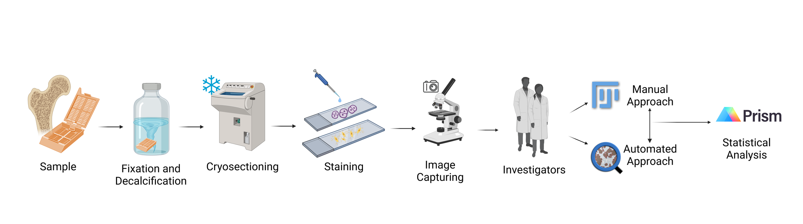
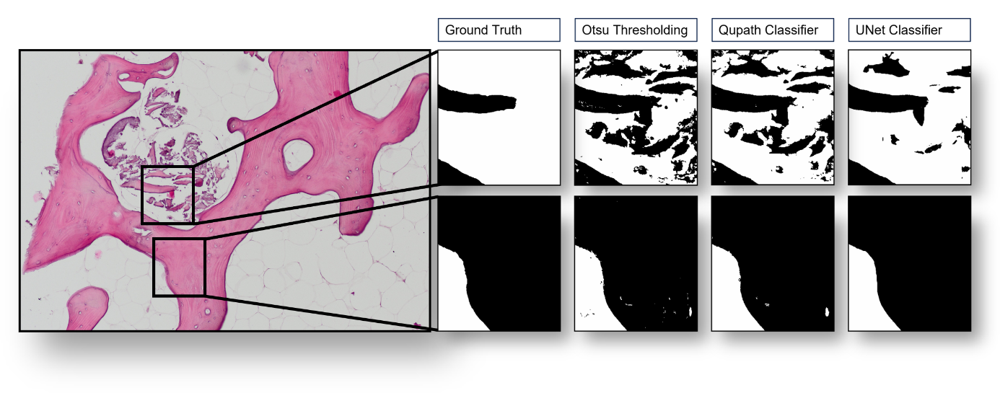

# Quantitative analysis of trabecular bone tissue cryosections via a fully automated neural network-based approach




## Structure

## Setup for U-Net and Otsu segmentation

### Download data

We provide our data and model checkpoints at: drive.
Extract the images to `./data` and models to `./trained_models`.

### Installation

For training and inference we use `pytorch`, please install it following the instructions on [their website](https://pytorch.org/get-started/locally/). All other dependencies may be installed using `pip install -r requirements.txt`.

### Usage

#### Segmenting images from the paper

This runs segmentation for images stored in `./data` using a U-Net (with the model checkpoint stored in `./trained_models`), and Otsu thresholding. Masks are stored as `.tif` files in `./results`.

```sh
python run_segmentation.py
```

#### Training the model with custom images

This trains the model using images and masks stored in `./training_data`. For our paper we used following parameters:

```sh
python train_unet.py --learning_rate 0.01 --num_epochs 100
```

The best checkpoint is stored in `./trained_models/best.pth`.

## Citation

```bibtex
@article{pohl2024,
    doi = {},
    author = {},
    journal = {},
    title = {Quantitative analysis of trabecular bone tissue cryosections via a fully automated neural network-based approach},
    year = {2024},
    volume = {},
    pages = {},
    number = {}
}
```
